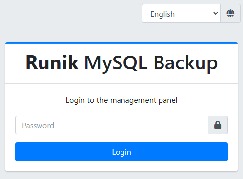
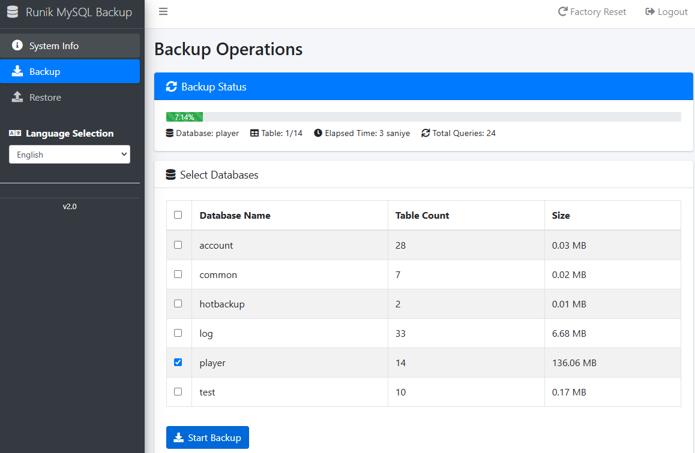
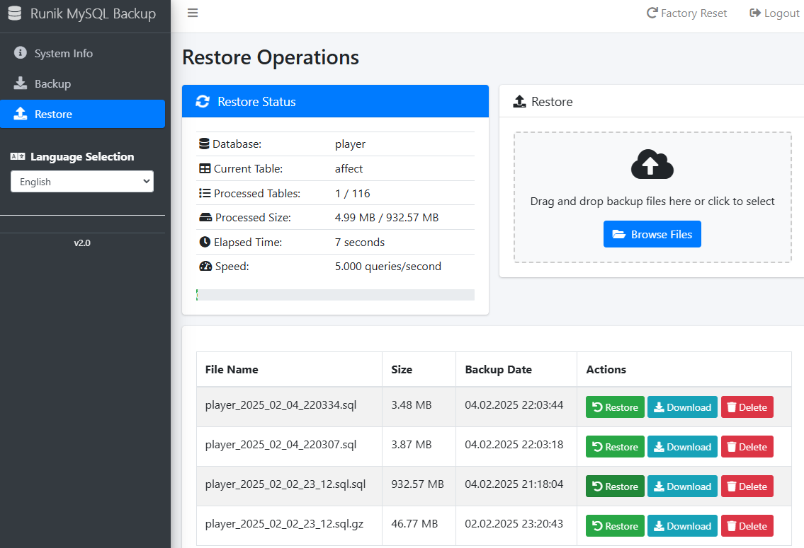

# Runik MySQL Backup Manager
Like MySQL Dumper: Big Data Backup and Restore.

[Runik MySQL Backup](https://hucrem.com)

A powerful, modern and user-friendly MySQL backup & restore manager built with PHP. Features a clean AdminLTE interface, multi-language support, and high-performance backup/restore capabilities for large databases.

## Features

- 🚀 High-performance backup and restore operations
- 🌐 Multi-language support (English, Turkish, Arabic)
- 📊 Real-time progress tracking with detailed statistics
- 💾 Chunked processing for large databases
- 🔒 Secure authentication system
- 📱 Responsive AdminLTE dashboard
- ⚡ AJAX-powered operations
- 🔄 Automatic backup scheduling
- 📈 System information monitoring

## Screenshots

<table>
  <tr>
    <td></td>
    <td></td>
    <td></td>
  </tr>
</table>

## Requirements

- PHP 7.4 or higher
- MySQL 5.7 or higher
- Apache/Nginx web server
- PDO PHP Extension
- ZIP PHP Extension
- Modern web browser

## Installation

1. Download or clone the repository
2. Upload to your web server
3. Navigate to the installation URL: `http://your-domain/install`
4. Follow the installation wizard
5. Login with your admin credentials

## Performance

- Handles databases up to 100GB+ efficiently
- Chunked processing prevents memory issues
- Processes ~1000 queries per second
- Real-time progress monitoring
- Automatic optimization during restore

## Technologies

- PHP 7.4+
- MySQL/MariaDB
- JavaScript/jQuery
- AJAX
- AdminLTE 3
- Bootstrap 4
- Font Awesome 5

## Languages Supported

- English
- Turkish (Türkçe)
- Arabic (العربية)

## Security

- Secure authentication
- CSRF protection
- XSS prevention
- SQL injection protection
- Session management
- IP-based access control (optional)

## Author

**Mehmet Selçuk Batal**
- Website: [https://www.runik.com.tr](https://www.runik.com.tr)
- Email: [info@runik.com.tr](mailto:info@runik.com.tr)
- LinkedIn: [linkedin.com/in/msbatal](https://linkedin.com/in/msbatal)
- Twitter: [@msbatal](https://twitter.com/msbatal)

## License

This project is licensed under the MIT License - see the [LICENSE](LICENSE) file for details.

## Contributing

Contributions are welcome! Please feel free to submit a Pull Request.

1. Fork the Project
2. Create your Feature Branch (`git checkout -b feature/AmazingFeature`)
3. Commit your Changes (`git commit -m 'Add some AmazingFeature'`)
4. Push to the Branch (`git push origin feature/AmazingFeature`)
5. Open a Pull Request